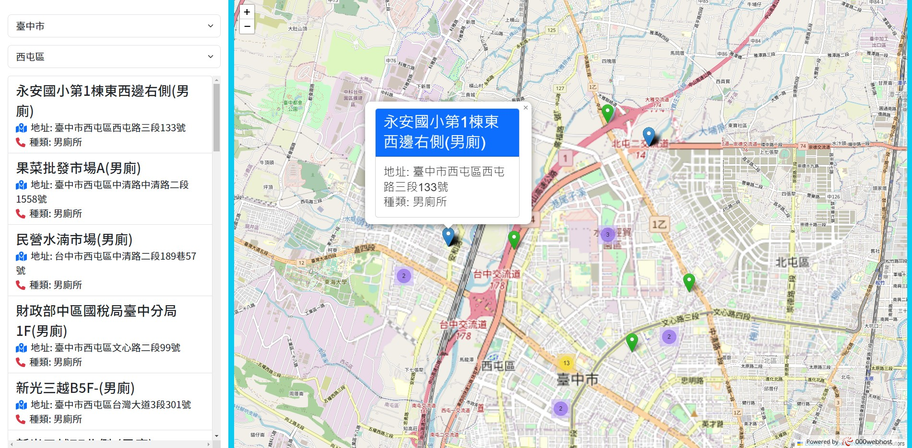

<h2>電影時刻表：查看所有類型電影的放映時間 (前臺)</h2>

<ol>
<li>使用Ajax實作</li>
<ul>
<li>會員註冊、登入</li>
<li>使用cookie保留會員狀態</li>
<li>排行榜&nbsp;(按電影介紹觸發點擊率，點擊數越多排行越前面)</li>
</ul>
<li>使用動畫(Class,JS相互運用)</li>
<ul>
<li>上映中的背景動畫</li>
<li>排行榜動畫</li>
</ul>
<li>使用Bootstrap 5</li>
<ul>
<li>RWD切版</li>
</ul>
<li>使用wow.js</li>
<li>使用slick.js</li>
</ol>
<h2>全國公廁位置查詢</h2>

<ol>
<li>Ajax 串接 公廁 API  與 台灣縣市鄉鎮 API。</li>
<li>使用 Leaflet 完成地圖呈現。</li>
<li>使用 MarkerClusterGroup 群組該區域的公廁。</li>
<li>針對使用者定位設置(HTML Geolocation API)。</li>
</ol>

